# Chic Cart - Modern Shopping Website

Chic Cart is a project aimed at replicating the functions and requirements of a real-time shopping website using XHTML, CSS, and JavaScript.

## Main Pages

- **Live Page:** Splash screen with logo, name, and motto.

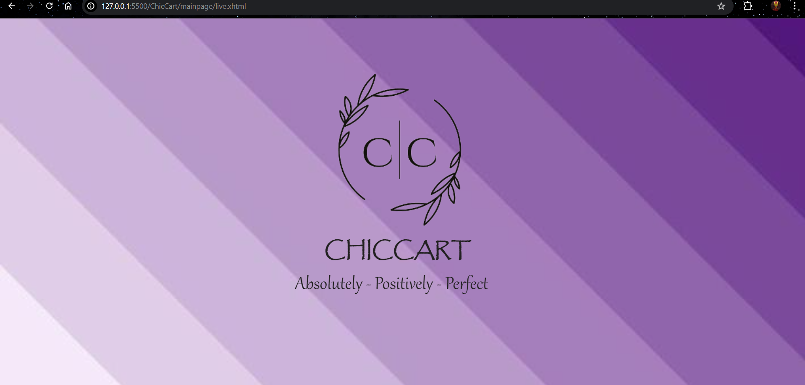

- **Main Page:** Navigation bar, footer with category details.

- **AboutUs Page:** 

## Home Pages

- **Beauty Homepage**
- **Home Living Homepage**
- **Kids Homepage**
- **Mens Homepage**
- **Womens Homepage**

## Data Pages

- **Mens Pages**

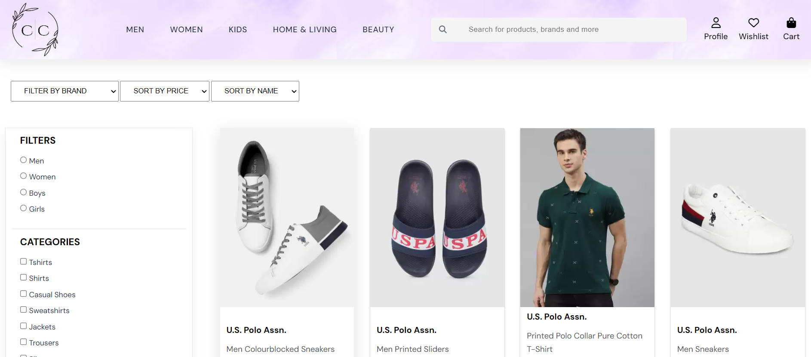

- **Womens Pages**

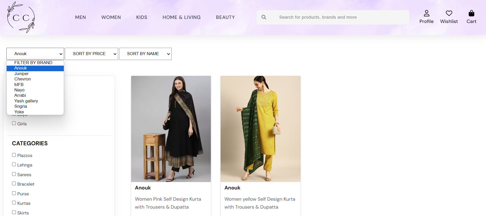

- **Kids Pages**
- **Home Furnishing Pages**
- **Beauty Pages**

## Payment Page

- **Address Page**

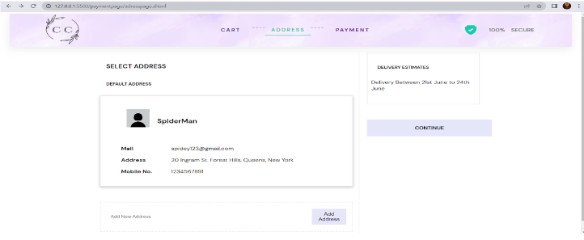

- **Contact Us Page**

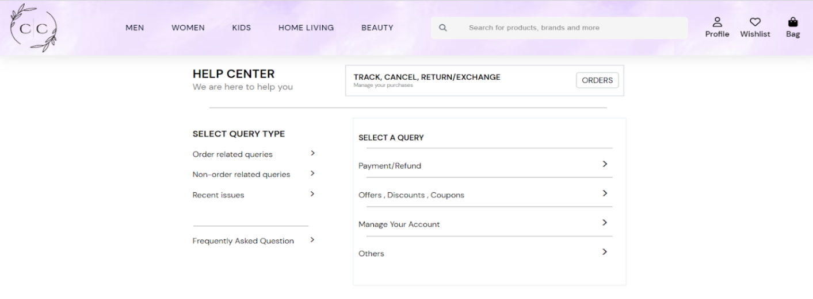

- **Payment Page**

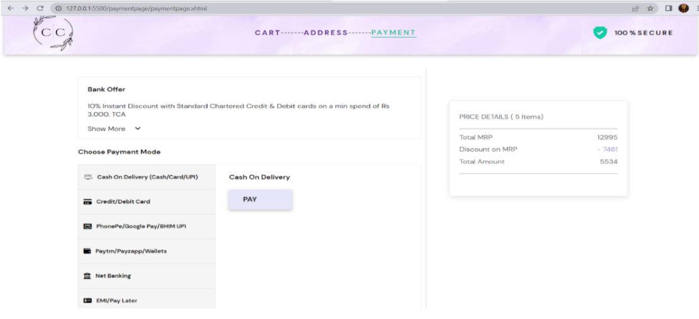

- **OTP Page**

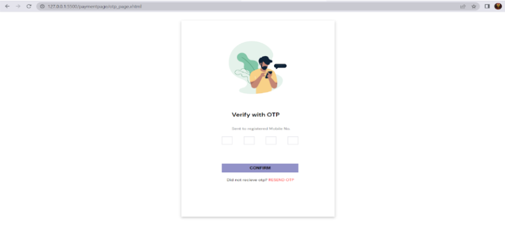

- **Successful Payment Page**

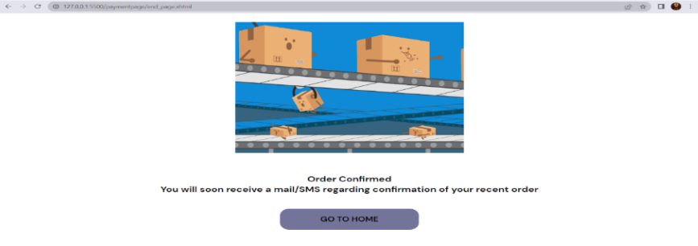

## Profile Page

- **Profile Page**

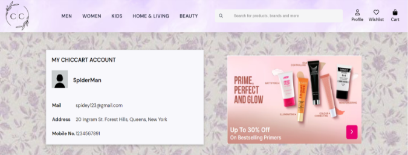

- **Signup Page**

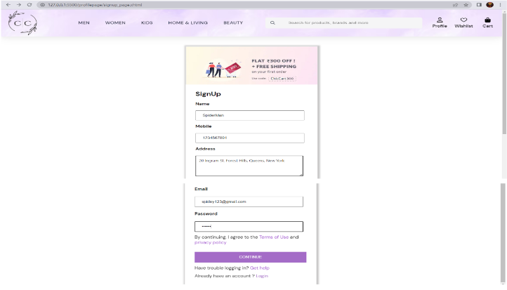

- **Login Page**

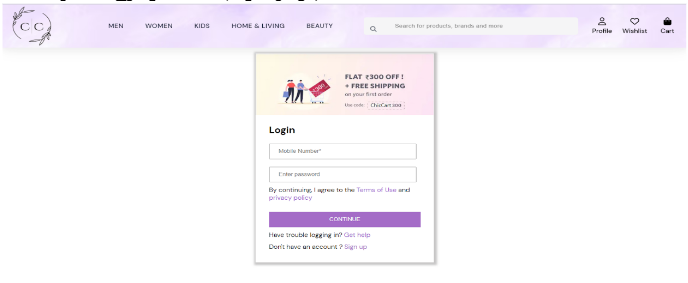

- **Successful Login Page**
- **Profile Page**

## Wishlist

- **Wishlist Page**
- **Cart Page**
